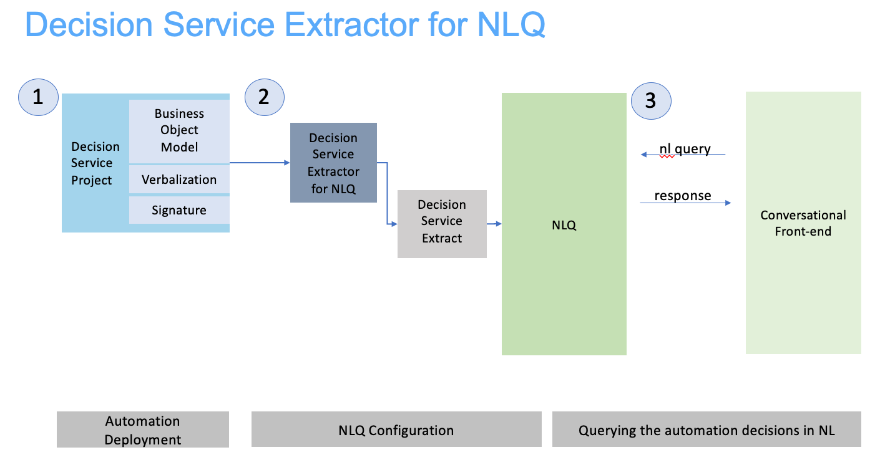

# Getting insights in automated decisions through Natural Language queries
## Extracting decision service models to feed NLQ

This folder contains the sample assets and prototyped components to plug NLQ capabilities on the top of BAI Decision events.
NLQ is capable of processing automated decision events without any additional data. Nevertheless its queries can be improved by injecting a description of the decision service that emits events.
This description covers:
- a verbalized business model composed of classes, attributes and methods with their technical names and corresponding NL verbalizations,
- the signature of the service composed of the input and output parameters. These pararameters specify the name, type and direction of the parameter when invoking the decision service,
- metadata including the path (RuleApp/version/Ruleset/version) carried by the event.



This automation service schema is defined as follows: [NLQ Import Schema](docs/README-NLQImportSchema.md "NLQImportSchema")

## Pre requisites
You need an IBM ODM 8.10.2 Rule Designer or upper installation to run the application. Easiest solution to perform such an installation is to leverage the instructions and materials at https://hub.docker.com/r/ibmcom/odm/

## Access to the code

Open an terminal where your have cloned this repository.
```console
cd decisions
```
## Structure
The repository contains Ecplise projects for decision service samples like Loan Validation, and a project to explore the BOM & VOC of the first ones. 

- decisions
  - Decision Service sample projects
  - DSExtractor4NLQ
    - DecisionServiceExtractorFromFiles
    - DecisionServiceExtractorFromProject

### DecisionServiceExtractorFromFiles
This project contains the necessary classes to extract BOM classes, verbalizations. It gives a simple API to specify the signature. 
The main class is DecisionServiceExporter that opens an ODM project , introspects given .bom and .voc files, composes the signature, and writes the export for NLQ.

The extractor source is availaible at:
- loading its BOM and VOC files. It is currenly not functional.

## Build
To build use maven or the eclipse project:  
mvn clean compile assembly:single  
This will create in the target folder an executable jar file: decision-service-explorer-0.0.1-jar-with-dependencies.jar

## Run 

```console
java -jar decision-service-explorer-0.0.1-jar-with-dependencies.jar [-verbose] -p \<path to ODM project> -d \<deployment name> [-o \<operation name>] -r \<rule set path> -output \<output json file path>  
```
\<path to ODM project>: The fully specified path to the ODM eclipse project  
\<deployment name>: The name of the deployment in the ODM project  
\<operation name>: The name of the operation in the specified deployment, optional if only one operation exist in the deployment.  
\<rule set path>: The ruleset path (example :/mydeployment/1.0/Miniloan_ServiceRuleset/1.0)  
\<output json file path>: Path and filename of the output json file  
  
Example:

```console
java -jar decision-service-explorer-0.0.1-jar-with-dependencies.jar -p ../../Decision Service sample projects/Loan Validation Service/Loan Validation Service -d production deployment -o loan validation production   -r /mydeployment/1.0/LoanValidation_ServiceRuleset/1.0  -output service.json
```

To generate the mapping.json and owl file of odm, pls use the command in the directory of `pre.txt`, which is in the root path, see following examples:
```console
java -jar target/decision-service-explorer-0.0.1-jar-with-dependencies.jar -p ../../Decision Service sample projects/Loan Validation Service/Loan Validation Service -d test deployment -o loan validation with score and grade -r /test_deployment/1.0/loan_validation_with_score_and_grade/1.0 -output odm-timeseries.json
```
Run this command, and the odm-timeseries.json, odm-timeseriesMapping.json and odm-timeseries.owl are generated. 

